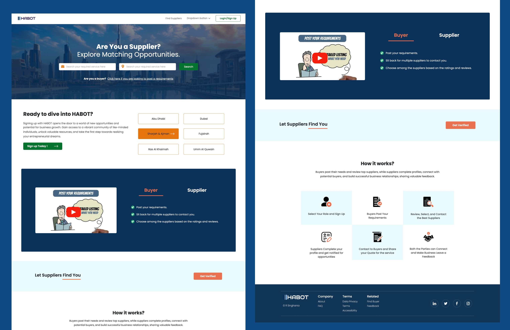

# Landing Page Project

## Table of Contents

- [Project Overview](#project-overview)
- [Features](#features)
- [Technologies Used](#technologies-used)
- [Installation](#installation)
- [Usage](#usage)

## Project Overview

This project is a static frontend landing page built using React. It serves as a demonstration of my skills in frontend development and design, created as part of an assessment for an interview process.

## Features

- Responsive design
- Modern and clean UI
- Uses React for component-based architecture
- Implemented with CSS for styling

## Technologies Used

- React
- CSS (or any CSS framework you used, e.g., Bootstrap, Tailwind CSS)
- HTML

## Installation

To run this project locally, follow these steps:

1. Clone the repository:
   git clone https://github.com/shiiivani/habot_landing_page.git

2. Navigate to the project directory:
   cd habot_anding_page

3. Install the dependencies:
   npm install

4. Start the development server:
   npm start

##To view live prototype visit:
https://shiiivani.github.io/habot_landing_page/
